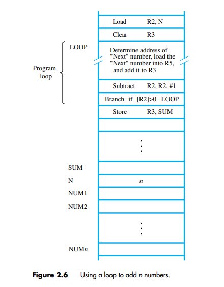
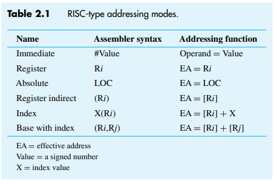

# Memory locations and addresses

- To execute a
  high-level language program on a processor, the program must be translated into the machine language for that
  processor, which is done by a compiler program.
- **Assembly language** is a readable symbolic representation
  of machine language.
- The memory consists of
  many millions of storage cells, each of which can store a bit of information having the value
  0 or 1.

> Q: Why bits are grouped?  
> A: Since a single bit represents a very small amount of information, bits are rarely handled individually. The usual approach is to deal with them in groups of fixed size. For this purpose, the memory is organized so that a group of n bits can be stored or retrieved in a single, basic operation. Each group of n bits is referred to as a **word** of information, and n is called the **word length**. The memory of a computer can be schematically represented
> as a collection of words, as shown in Figure 2.1.

If the word length of a computer is 32 bits, a single word can store a 32-bit signed number or four
ASCII-encoded characters, each occupying 8 bits, as shown in Figure 2.2.

## Addressing

- Accessing the memory to store or retrieve a single item of information, either a word
  or a byte, requires distinct names or **addresses** for each location
- It is customary to use
  numbers from 0 to 2k − 1, for some suitable value of k, as the addresses of successive
  locations in the memory.
- Thus, the memory can have up to 2k addressable locations. The 2k addresses constitute the **address space** of the computer \* For example, a 24-bit address
  generates an address space of 224 (16,777,216) locations
  > 1Mega - 2^20  
  > 1Giga - 2^30  
  > 1Kilo - 2^10  
  > 1Tera - 2^40

## Byte Addressability

- We now have three basic information quantities to deal with: bit, byte, and word
- A byte is always 8 bits, but the word length typically ranges from 16 to 64 bits
- It is impractical
  to assign distinct addresses to individual bit locations in the memory.
- The most practical
  assignment is to have successive addresses refer to successive byte locations in the memory. The term **byte-addressable memory**
  is used for this assignment
- Byte locations have addresses 0, 1, 2,.... Thus, if the word
  length of the machine is 32 bits, successive words are located at addresses 0, 4, 8,..., with
  each word consisting of four bytes.

## Big-Endian and Little-Endian Assignments

- The name **big-endian** is used when lower byte addresses are used for the more significant
  bytes (the leftmost bytes) of the word.
- The name **little-endian** is used for the opposite
  ordering, where the lower byte addresses are used for the less significant bytes (the rightmost
  bytes) of the word
>   

## Word alignment

- In the case of a 32-bit word length, natural word boundaries occur at addresses 0, 4, 8,...,
  as shown in Figure 2.3
- We say that the word locations have **aligned** addresses if they begin
  at a byte address that is a multiple of the number of bytes in a word.
- aligned addresses makes accessing of memory operands more efficient
## Accessing Numbers and Characters
A number usually occupies one word, and can be accessed in the memory by specifying its
word address. Similarly, individual characters can be accessed by their byte address.

# Memory Operations (not in course plan)
Both program instructions and data operands are stored in the memory. To execute an
instruction, the processor control circuits must cause the word (or words) containing the
instruction to be transferred from the memory to the processor. Operands and results must
also be moved between the memory and the processor. Thus, two basic operations involving
the memory are needed, namely, Read and Write.
## READ operation
* The Read operation transfers a copy of the contents of a specific memory location to
the processor. The memory contents remain unchanged. 
* To start a Read operation, the
processor sends the address of the desired location to the memory and requests that its
contents be read. 
* The memory reads the data stored at that address and sends them to the
processor.
## WRITE operation
* The Write operation transfers an item of information from the processor to a specific
memory location, overwriting the former contents of that location. 
* To initiate a Write
operation, the processor sends the address of the desired location to the memory, together
with the data to be written into that location. 
* The memory then uses the address and data
to perform the write.

# Instructions and Instruction Sequencing
A computer must
have instructions capable of performing four types of operations:  
* Data transfers between the memory and the processor registers
* Arithmetic and logic operations on data
* Program sequencing and control
* I/O transfers

We begin by discussing instructions for the first two types of operations. To facilitate the
discussion, we first need some notation.

## Register Transfer Notation
* We need to describe the transfer of information from one location in a computer to another. Possible locations that may be involved in such transfers are memory locations, processor
registers, or registers in the I/O subsystem
* To describe the transfer of information, the contents of any
location are denoted by placing square brackets around its name. 
    *  Thus, the expression **R2 ← [LOC]** means that the contents of memory location LOC are transferred into processor register R2.
    * As another example, consider the operation that adds the contents of registers R2 and
    R3, and places their sum into register R4. This action is indicated as
    **R4 ← [R2]+[R3]**

This type of notation is known as **Register Transfer Notation** (RTN).
## Assembly-Language Notation
-> Load R2, LOC
* The contents of LOC are unchanged by the execution of this instruction, but the old contents
of register R2 are overwritten. The name Load is appropriate for this instruction, because
the contents read from a memory location are loaded into a processor register.

-> Add R4, R2, R3
* The second example of adding two numbers contained in processor registers R2 and
R3 and placing their sum in R4 can be specified by this assembly-language statement  

-> Store R4, R5
* Store \<src>, \<destination>

## RISC Instruction Sets
* Each instruction fits in a single word.
* A load/store architecture is used, in which
    * Memory operands are accessed only using Load and Store instructions.
    * All operands involved in an arithmetic or logic operation must either be in processor registers, or one of the operands may be given explicitly within the instruction word.
> Note: At the start of execution of a program, all instructions and data used in the program are
stored in the memory of a computer. Processor registers do not contain valid operands at
that time. If operands are expected to be in processor registers before they can be used by
an instruction, then it is necessary to first bring these operands into the registers. This task
is done by _Load_ instructions which copy the contents of a memory location into a processor
register.
### Example
* Let us now consider a typical arithmetic operation C = A + B
* For simplicity, we will refer to the addresses of these
locations as A, B, and C, respectively. 
* Hence, the above high-level language statement requires the action
**C ← [A]+[B]**
* To carry out this action, the contents of memory locations A
and B are fetched from the memory and transferred into the processor where their sum is
computed. This result is then sent back to the memory and stored in location C.
* The required action can be accomplished by a sequence of simple machine instructions.
We choose to use registers R2, R3, and R4 to perform the task with four instructions:
    * Load R2, A
    * Load R3, B
    * Add R4, R2, R3
    * Store R4, C

## Instruction Execution and Straight-Line Sequencing
### Steps in a program execution
* The processor contains a register called
the **program counter** (PC), which holds the address of the next instruction to be executed.
* To begin executing a program, the address of its first instruction (i in our example) must be
placed into the PC.
* Then, the processor control circuits use the information in the PC to fetch
and execute instructions, one at a time, in the order of increasing addresses. This is called
**straight-line sequencing**.
* During the execution of each instruction, the PC is incremented
by 4 to point to the next instruction.
* Once the current program is over, the PC is incremented by 4  which is now the address of the first instruction of the next program segment.
    ___
* Executing a given instruction is a two-phase procedure. 
* In the first phase, called
**instruction fetch**, the instruction is fetched from the memory location whose address is in
the PC. This instruction is placed in the _**instruction register**_ (IR) in the processor. 
* At the
start of the second phase, called **instruction execute**, the instruction in IR is examined to
determine which operation is to be performed. The specified operation is then performed
by the processor. 

## Branch instructions
* This type of instruction loads a new address into the program counter. 
*  As a result, the processor fetches and executes the instruction
at this new address, called the _branch target_, instead of the instruction at the location that
follows the branch instruction in sequential address order.
* A conditional branch instruction
causes a branch only if a specified condition is satisfied. If the condition is not satisfied, the
PC is incremented in the normal way, and the next instruction in sequential address order
is fetched and executed.
  
* In the program in Figure 2.6, the instruction
**Branch_if_[R2]>0 LOOP** is a conditional branch instruction that causes a branch to location LOOP if the contents
of register R2 are greater than zero. 

## Addressing Modes
The different ways for specifying the locations of instruction operands are known as **addressing
modes**. 
  
